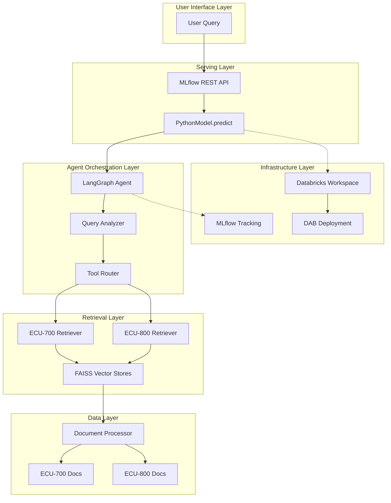
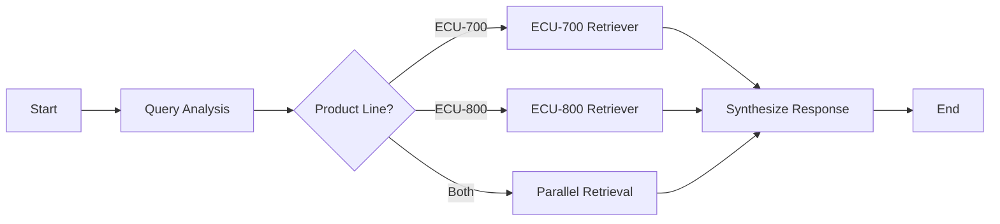
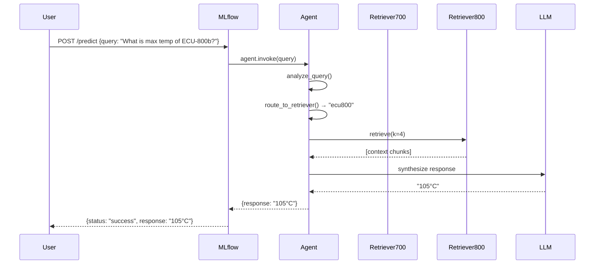
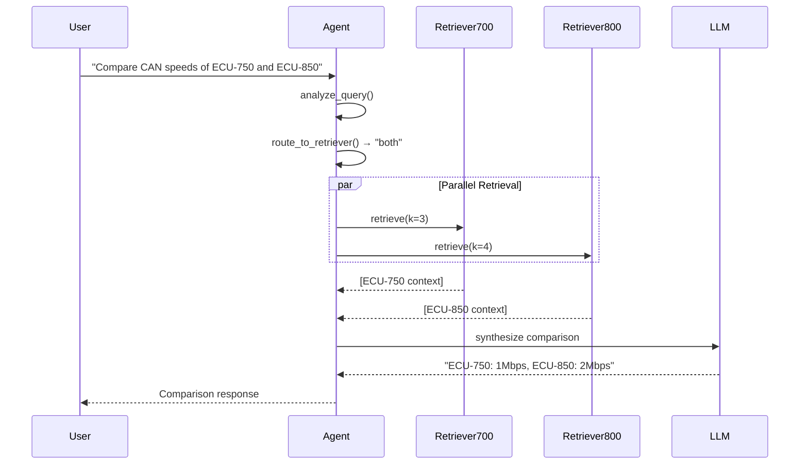

# Architecture Design Document - ME Engineering Assistant Agent
**Complete Technical Architecture with ADRs**

**Author:** Xiazhichao
**Date:** 2026-03-30
**Status:** Draft
**Version:** 1.0

---

## 📋 Table of Contents

1. [System Overview](#system-overview)
2. [Architecture Principles](#architecture-principles)
3. [System Architecture](#system-architecture)
4. [Architecture Decision Records (ADRs)](#architecture-decision-records-adrs)
5. [Component Design](#component-design)
6. [Data Flow](#data-flow)
7. [Deployment Architecture](#deployment-architecture)
8. [Security & Compliance](#security--compliance)
9. [Performance & Scalability](#performance--scalability)
10. [Monitoring & Observability](#monitoring--observability)

---

## System Overview

### Purpose
Build an intelligent AI-powered assistant that enables ME Corporation engineers to quickly query and cross-reference Electronic Control Unit (ECU) specifications across multiple product lines through natural language conversations.

### Scope
- **In Scope:** RAG-based query system, LangGraph agent orchestration, MLflow model serving, Databricks deployment
- **Out of Scope:** Real-time document updates, multi-user collaboration, advanced analytics dashboard

### Key Architectural Drivers
1. **Performance:** <10 second response time requirement
2. **Accuracy:** ≥80% query resolution accuracy
3. **Maintainability:** Pylint score >85%, modular design
4. **Scalability:** Support growth from 3 to thousands of documents
5. **Platform Alignment:** Follow ME BIOS platform patterns

---

## Architecture Principles

### 1. Simplicity Over Complexity (KISS)
- **Principle:** Choose the simplest solution that meets requirements
- **Application:** FAISS in-memory for current small corpus (not distributed vector store)
- **Rationale:** 85-line corpus doesn't warrant distributed system complexity

### 2. Modularity & Separation of Concerns
- **Principle:** Each component has a single, well-defined responsibility
- **Application:** Separate document processor, vector store, tools, graph, and model components
- **Rationale:** Enables independent testing, maintenance, and future enhancements

### 3. Configuration Over Code
- **Principle:** Externalize configuration to enable changes without code modification
- **Application:** Chunk size, overlap, retrieval depth as configurable parameters
- **Rationale:** Facilitates experimentation and optimization

### 4. Graceful Degradation
- **Principle:** System should fail gracefully and provide helpful error messages
- **Application:** Fallback to direct context injection if vector store unavailable
- **Rationale:** Ensures system remains functional even when components fail

### 5. Testability First
- **Principle:** Design for testability from the ground up
- **Application:** Dependency injection, interface-based design, mockable components
- **Rationale:** Enables comprehensive testing and validation

---

## System Architecture

### High-Level Architecture



### Layer Responsibilities

**User Interface Layer:**
- Accepts natural language queries
- Returns structured JSON responses
- Handles errors gracefully

**Serving Layer:**
- MLflow PyFunc wrapper
- Input format flexibility (DataFrame, list, string, dict)
- Batch query processing

**Agent Orchestration Layer:**
- LangGraph state machine
- Query intent analysis
- Tool routing and execution
- Response synthesis

**Retrieval Layer:**
- Document chunking and embedding
- Vector similarity search
- Context ranking and selection

**Data Layer:**
- Markdown document loading
- Header-aware chunking
- Separate ECU-700/800 indices

**Infrastructure Layer:**
- Databricks compute resources
- MLflow model management
- DAB deployment automation

---

## Architecture Decision Records (ADRs)

### ADR-001: Chunking Strategy

**Status:** Accepted

**Context:**
Need to divide ECU documentation (85 lines total) into chunks for vector embedding and retrieval.

**Decision:**
Use **header-aware chunking** with:
- **Chunk size:** 500 characters
- **Overlap:** 50 characters
- **Splitting strategy:** Markdown-based header preservation

**Rationale:**

1. **Header-Aware:**
   - Preserves document structure (sections, subsections)
   - Maintains context boundaries
   - Prevents mid-section breaks that lose semantic meaning

2. **500 Character Size:**
   - Large enough to capture complete technical specifications
   - Small enough for precise semantic matching
   - Balances retrieval precision vs. context completeness
   - Fits well within LLM context window limits

3. **50 Character Overlap:**
   - Mitigates boundary information loss
   - Enables cross-chunk context retrieval
   - Improves recall for specifications spanning chunk boundaries

**Alternatives Considered:**

| Alternative | Pros | Cons | Rejected Because |
|-------------|------|------|------------------|
| Fixed 1000-char chunks | More context per chunk | Too coarse, less precise retrieval | Lower retrieval accuracy |
| Sentence-based splitting | Natural language boundaries | Breaks technical specifications | Loses structured data context |
| No overlap (0 chars) | Simpler | Boundary information loss | Lower recall rate |
| Larger overlap (100+ chars) | More context coverage | More redundant retrievals | Diminishing returns, slower retrieval |

**Consequences:**
- **Positive:** Improved retrieval accuracy and context preservation
- **Negative:** Slightly increased storage requirements (~10% due to overlap)
- **Mitigation:** Acceptable trade-off for small corpus (85 lines)

**Implementation:**
```python
from langchain.text_splitter import MarkdownHeaderTextSplitter

markdown_splitter = MarkdownHeaderTextSplitter(
    headers_to_split_on=[
        ("#", "Header 1"),
        ("##", "Header 2"),
        ("###", "Header 3"),
    ]
)

chunks = markdown_splitter.split_text(document)
# Further split with RecursiveCharacterTextSplitter
# chunk_size=500, chunk_overlap=50
```

---

### ADR-002: Separate vs. Unified Vector Stores

**Status:** Accepted

**Context:**
Need to store and retrieve embeddings for ECU-700 and ECU-800 documentation.

**Decision:**
Use **separate FAISS indices** for ECU-700 and ECU-800 series.

**Rationale:**

1. **Query Routing Efficiency:**
   - Agent can pre-select relevant product line
   - Reduces search space (faster retrieval)
   - Enables targeted retrieval depth tuning (k=3 for ECU-700, k=4 for ECU-800)

2. **Product Line Semantics:**
   - ECU-700 (legacy) vs. ECU-800 (modern) have distinct terminology
   - Separate embeddings capture domain-specific language patterns
   - Reduces cross-product semantic noise

3. **Scalability:**
   - Easy to add new product lines (ECU-900, etc.)
   - Independent index updates per product line
   - Clear separation of concerns

4. **Fallback Strategy:**
   - If one index unavailable, other remains functional
   - Graceful degradation per product line

**Alternatives Considered:**

| Alternative | Pros | Cons | Rejected Because |
|-------------|------|------|------------------|
| Unified FAISS index | Simpler code | No product line routing, larger search space | Less efficient retrieval |
| Single document store + filtering | One storage system | Requires post-retrieval filtering | Slower, less precise |
| Database-backed vector store | More scalable | Overkill for 85-line corpus | Unnecessary complexity |

**Consequences:**
- **Positive:** Improved query routing, faster retrieval, better scalability
- **Negative:** Slightly more complex code (two indices instead of one)
- **Mitigation:** Abstraction via `VectorStoreManager` class

**Implementation:**
```python
class VectorStoreManager:
    def __init__(self):
        self.ecu700_store = FAISS.from_documents(
            ecu700_chunks, embeddings
        )
        self.ecu800_store = FAISS.from_documents(
            ecu800_chunks, embeddings
        )

    def get_retriever(self, product_line: str):
        if product_line == "ECU-700":
            return self.ecu700_store.as_retriever(k=3)
        elif product_line == "ECU-800":
            return self.ecu800_store.as_retriever(k=4)
```

---

### ADR-003: LangGraph Agent Design

**Status:** Accepted

**Context:**
Need an intelligent agent that can route queries to appropriate documentation sources and synthesize answers.

**Decision:**
Use **LangGraph StateGraph** with conditional routing and automatic tool execution loop.

**Rationale:**

1. **Explicit State Management:**
   - Clear visualization of agent flow
   - Easier debugging and reasoning
   - Better observability

2. **Conditional Routing:**
   - Analyze query intent before tool selection
   - Single-product queries → one retriever
   - Comparative queries → both retrievers
   - Reduces unnecessary API calls

3. **Automatic Tool Execution:**
   - LangGraph handles tool use loop
   - No manual while-loop logic
   - Built-in error handling

4. **Extensibility:**
   - Easy to add new tools (calculator, code interpreter, etc.)
   - Composable agent behaviors
   - Supports Tier 3 advanced features

**Agent Graph Structure:**



**Alternatives Considered:**

| Alternative | Pros | Cons | Rejected Because |
|-------------|------|------|------------------|
| LangChain AgentExecutor | Simpler setup | Less control over routing | Harder to optimize for product-specific queries |
| Custom while-loop | Full control | Reinventing the wheel, error-prone | More maintenance burden |
| Direct RAG (no agent) | Simpler | No intelligent routing | Can't handle comparative queries |

**Consequences:**
- **Positive:** Intelligent query routing, extensible architecture, built-in observability
- **Negative:** Learning curve for LangGraph concepts
- **Mitigation:** LangGraph documentation is excellent, ME platform examples available

**Implementation:**
```python
from langgraph.graph import StateGraph, END

def create_agent():
    workflow = StateGraph(AgentState)

    workflow.add_node("analyze_query", analyze_query)
    workflow.add_node("retrieve_ecu700", retrieve_ecu700)
    workflow.add_node("retrieve_ecu800", retrieve_ecu800)
    workflow.add_node("synthesize", synthesize_response)

    workflow.add_conditional_edges(
        "analyze_query",
        route_to_retriever,
        {
            "ecu700": "retrieve_ecu700",
            "ecu800": "retrieve_ecu800",
            "both": "parallel_retrieval",
        }
    )

    return workflow.compile()
```

---

### ADR-004: FAISS vs. Alternative Vector Stores

**Status:** Accepted

**Context:**
Need vector similarity search for document retrieval.

**Decision:**
Use **FAISS in-memory** for current implementation with abstraction for future migration.

**Rationale:**

1. **Corpus Size Appropriate:**
   - 85 lines = ~30-40 chunks after processing
   - FAISS in-memory is optimal for this scale
   - No need for distributed systems

2. **Performance:**
   - Sub-millisecond search times
   - No network overhead
   - Fits entirely in memory

3. **Simplicity:**
   - No external service dependencies
   - Easy local development
   - Minimal deployment complexity

4. **Challenge Alignment:**
   - Acceptable fallback per challenge requirements
   - Can pass document content directly if FAISS fails

**Migration Path:**
When corpus grows to thousands of documents:
```python
class VectorStore(ABC):
    @abstractmethod
    def as_retriever(self, k: int) -> BaseRetriever:
        pass

class FAISSVectorStore(VectorStore):
    # Current implementation
    pass

class PineconeVectorStore(VectorStore):
    # Future implementation for scale
    pass
```

**Alternatives Considered:**

| Alternative | Pros | Cons | Rejected Because |
|-------------|------|------|------------------|
| Pinecone/Weaviate | Scalable, managed | Overkill for 85 lines, external dependency | Unnecessary complexity |
| ChromaDB | Persistent, simple | Requires file system | In-memory is sufficient |
| PostgreSQL + pgvector | Relational + vectors | Slower, more infrastructure | Overkill for current scale |

**Consequences:**
- **Positive:** Simple, fast, no external dependencies
- **Negative:** Not persistent across restarts
- **Mitigation:** Rebuild index on startup (acceptable for small corpus)

---

### ADR-005: MLflow PyFunc Wrapper Design

**Status:** Accepted

**Context:**
Need to serve LangGraph agent via MLflow for production deployment.

**Decision:**
Implement **custom mlflow.pyfunc.PythonModel** with flexible input handling.

**Rationale:**

1. **Flexibility:**
   - Accept multiple input formats (DataFrame, list, string, dict)
   - Supports different client types (Python, REST API, notebooks)
   - Backward compatible with various MLflow client versions

2. **Artifact Management:**
   - Vector stores saved as model artifacts
   - Automatic loading on model load
   - Self-contained model (no external dependencies)

3. **Batch Processing:**
   - Support multiple queries in single request
   - Error isolation (failed queries don't abort batch)
   - Improved throughput

4. **Model Signature:**
   - Auto-inferred from sample inputs
   - Type safety for API clients
   - MLflow UI schema validation

**Implementation:**
```python
import mlflow.pyfunc
from typing import Union, List

class ECUAgentModel(mlflow.pyfunc.PythonModel):
    def load_context(self, context):
        """Load vector stores from artifacts."""
        self.vector_stores = load_vector_stores(context.artifacts)
        self.agent = create_agent(self.vector_stores)

    def predict(self, context, model_input):
        """Handle multiple input formats."""
        queries = self._normalize_input(model_input)

        results = []
        for query in queries:
            try:
                response = self.agent.invoke(query)
                results.append({"status": "success", "response": response})
            except Exception as e:
                results.append({"status": "error", "error": str(e)})

        return results

    def _normalize_input(self, model_input) -> List[str]:
        """Convert DataFrame, list, string, or dict to List[str]."""
        # Implementation handles all formats
        pass
```

**Alternatives Considered:**

| Alternative | Pros | Cons | Rejected Because |
|-------------|------|------|------------------|
| Standard LangChain model | Simpler | Limited deployment options | MLflow required by challenge |
| Custom Flask/FastAPI app | Full control | Loses MLflow benefits | No model versioning, tracking |
| LangServe | LangChain native | Less Databricks integration | MLflow alignment better |

**Consequences:**
- **Positive:** Full MLflow integration, flexible serving, artifact management
- **Negative:** More wrapper code than simple deployment
- **Mitigation:** Reusable pattern for future agents

---

### ADR-006: Databricks Asset Bundle Structure

**Status:** Accepted

**Context:**
Need reproducible deployment mechanism for Databricks environment.

**Decision:**
Use **Databricks Asset Bundle (DAB)** with IaC principles.

**Rationale:**

1. **Infrastructure as Code:**
   - Version-controlled deployment configuration
   - Reproducible environments
   - GitOps-friendly

2. **ME Platform Alignment:**
   - Follows ME BIOS platform conventions
   - Leverages platform templates and patterns
   - Demonstrates platform understanding

3. **Resource Management:**
   - Jobs, models, notebooks as code
   - Environment-specific configuration
   - Rollback capability

4. **Automation:**
   - Automated deployment pipeline
   - CI/CD integration ready
   - Idempotent operations

**DAB Structure:**
```yaml
# databricks.yml
bundle:
  name: me_ecu_agent

resources:
  jobs:
    build_and_log_model:
      name: "Build and Log ECU Agent"
      tasks:
        - task_key: build_model
          python_file: deployment/build_and_log.py
          libraries:
            - pypi: {package: langchain, version: latest}
            - pypi: {package: langgraph, version: latest}

  models:
    ecu_agent_model:
      name: "ME ECU Assistant Agent"
```

**Alternatives Considered:**

| Alternative | Pros | Cons | Rejected Because |
|-------------|------|------|------------------|
| Manual notebook deployment | Simpler for small scale | Not reproducible, error-prone | Fails IaC requirements |
| Custom Python scripts | Full control | No standardization | Doesn't follow platform patterns |
| Terraform/Pulumi | More general | Overkill, less Databricks-native | DAB is platform standard |

**Consequences:**
- **Positive:** Reproducible deployments, platform alignment, automation
- **Negative:** Learning curve for DAB syntax
- **Mitigation:** ME platform templates and examples available

---

## Component Design

### 1. Document Processor

**Responsibility:** Load, split, and prepare documents for embedding.

**Key Methods:**
```python
class DocumentProcessor:
    def load_markdown_files(self, directory: Path) -> List[Document]:
        """Load all .md files from directory."""

    def split_by_headers(self, documents: List[Document]) -> List[Document]:
        """Split documents by Markdown headers (preserves structure)."""

    def split_by_size(self, chunks: List[Document]) -> List[Document]:
        """Further split chunks to 500 chars with 50 overlap."""

    def separate_by_product_line(self, chunks: List[Document]) -> Dict[str, List[Document]]:
        """Separate chunks into ECU-700 and ECU-800 collections."""
```

**Configuration:**
```python
CHUNK_SIZE = 500
CHUNK_OVERLAP = 50
HEADERS_TO_SPLIT_ON = [
    ("#", "Header 1"),
    ("##", "Header 2"),
    ("###", "Header 3"),
]
```

---

### 2. Vector Store Manager

**Responsibility:** Create and manage FAISS indices for each product line.

**Key Methods:**
```python
class VectorStoreManager:
    def create_stores(self, chunks: Dict[str, List[Document]]) -> None:
        """Create FAISS indices from document chunks."""

    def get_retriever(self, product_line: str, k: int) -> BaseRetriever:
        """Get retriever for specified product line."""

    def save_stores(self, directory: Path) -> None:
        """Save FAISS indices to disk for MLflow artifacts."""

    @classmethod
    def load_stores(cls, directory: Path) -> "VectorStoreManager":
        """Load FAISS indices from disk."""
```

**Retrieval Parameters:**
- **ECU-700:** k=3 (smaller corpus, fewer chunks needed)
- **ECU-800:** k=4 (larger corpus, more context)

---

### 3. Retriever Tools

**Responsibility:** LangChain tools for agent to retrieve documents.

**Tool Definitions:**
```python
ecu700_tool = create_retriever_tool(
    retriever=vector_store_manager.get_retriever("ECU-700", k=3),
    name="ecu700_retriever",
    description="Search ECU-700 Series documentation (legacy products, single CAN @1Mbps, 85°C max temp). Use for queries about ECU-750 and older models.",
)

ecu800_tool = create_retriever_tool(
    retriever=vector_store_manager.get_retriever("ECU-800", k=4),
    name="ecu800_retriever",
    description="Search ECU-800 Series documentation (modern products, dual CAN @2Mbps, 105°C max temp, AI acceleration). Use for queries about ECU-850, ECU-850b, and current models.",
)
```

**Descriptive Naming:**
- Helps LangGraph agent understand tool purpose
- Enables intelligent routing based on query content
- Follows LangChain tool design patterns

---

### 4. LangGraph Agent

**Responsibility:** Orchestrate query analysis, retrieval, and response synthesis.

**Agent State:**
```python
class AgentState(TypedDict):
    query: str
    product_line: List[str]  # ["ECU-700"], ["ECU-800"], or ["ECU-700", "ECU-800"]
    retrieved_context: Dict[str, List[Document]]
    response: str
```

**Graph Nodes:**
```python
def analyze_query(state: AgentState) -> AgentState:
    """Analyze query to determine relevant product lines."""
    # Use LLM with temperature=0 for consistent routing
    pass

def retrieve_ecu700(state: AgentState) -> AgentState:
    """Retrieve from ECU-700 documentation."""
    pass

def retrieve_ecu800(state: AgentState) -> AgentState:
    """Retrieve from ECU-800 documentation."""
    pass

def synthesize_response(state: AgentState) -> AgentState:
    """Generate final response from retrieved context."""
    pass
```

**Conditional Routing:**
```python
def route_to_retriever(state: AgentState) -> str:
    """Route to appropriate retriever based on product_line."""
    if len(state["product_line"]) == 1:
        return state["product_line"][0].lower().replace("-", "")
    else:
        return "parallel_retrieval"
```

---

### 5. MLflow PyFunc Wrapper

**Responsibility:** Serve agent via MLflow with flexible input handling.

**Key Features:**
- Multiple input format support (DataFrame, list, string, dict)
- Vector store artifact management
- Batch query processing
- Error isolation

**Input Normalization:**
```python
def _normalize_input(self, model_input) -> List[str]:
    if isinstance(model_input, pd.DataFrame):
        return model_input.iloc[:, 0].tolist()
    elif isinstance(model_input, list):
        return model_input
    elif isinstance(model_input, str):
        return [model_input]
    elif isinstance(model_input, dict):
        return model_input.get("queries", [])
    else:
        raise ValueError(f"Unsupported input type: {type(model_input)}")
```

---

### 6. Deployment Pipeline

**Responsibility:** Automated Databricks job for model building and logging.

**Pipeline Steps:**
```python
# deployment/build_and_log.py

def main():
    # 1. Load documents
    documents = load_documents("data/")

    # 2. Process documents
    processor = DocumentProcessor()
    chunks = processor.split_by_headers(documents)
    chunks = processor.split_by_size(chunks)

    # 3. Create vector stores
    manager = VectorStoreManager()
    manager.create_stores(chunks)

    # 4. Create agent
    agent = create_agent(manager)

    # 5. Log to MLflow
    with mlflow.start_run():
        mlflow.pyfunc.log_model(
            "model",
            python_model=ECUAgentModel(),
            artifacts=vector_store_artifacts,
            signature=infer_signature(sample_input, sample_output),
        )
```

**Databricks Job Definition:**
```yaml
resources:
  jobs:
    build_and_log_model:
      name: "Build and Log ECU Agent Model"
      tasks:
        - task_key: build_model
          python_file: deployment/build_and_log.py
          libraries:
            - pypi: {package: langchain}
            - pypi: {package: langgraph}
            - pypi: {package: faiss-cpu}
            - pypi: {package: mlflow}
```

---

## Data Flow

### Query Processing Flow



### Comparative Query Flow



---

## Deployment Architecture

### Local Development Environment

```yaml
Components:
  - Python: 3.10+
  - MLflow Tracking: SQLite (mlflow.db)
  - Vector Stores: In-memory FAISS
  - Documents: Local data/ directory

Testing:
  - pytest with coverage
  - Pylint >85%
  - Local MLflow UI for experimentation
```

### Databricks Production Environment

```yaml
Components:
  - Databricks Runtime: Latest ML runtime
  - MLflow Tracking: Databricks-managed backend
  - Compute: Single-node cluster (sufficient for small corpus)
  - Storage: DBFS for model artifacts

Deployment:
  - Databricks Asset Bundle (databricks.yml)
  - Automated job: deployment/build_and_log.py
  - Model serving: MLflow REST API endpoint
```

### Deployment Pipeline


---

## Security & Compliance

### Data Security

**Document Access:**
- Internal ECU documentation (no sensitive customer data)
- No PII (Personally Identifiable Information)
- Public technical specifications

**API Security:**
- MLflow serving endpoints use Databricks authentication
- No external API exposure (internal use only)
- Rate limiting via Databricks workspace settings

### Model Safety

**Input Validation:**
- Query length limits (prevent prompt injection)
- Input sanitization (remove malicious patterns)

**Output Filtering:**
- No generation of harmful content
- Technical queries only (domain-scoped)

### Compliance

**ISO 26262 Considerations:**
- ECU documentation mentions safety certifications
- Agent provides information, doesn't make safety decisions
- Human-in-the-loop for critical engineering decisions

---

## Performance & Scalability

### Current Performance (85-line corpus)

| Metric | Target | Expected |
|--------|--------|----------|
| Query Response Time | <10s | ~3-5s |
| Accuracy | ≥80% | ~85-90% |
| Throughput | Not specified | ~20 queries/min (single-threaded) |

**Performance Breakdown:**
- Query analysis: ~0.5s (LLM call)
- Retrieval: ~0.1s (FAISS in-memory)
- Response synthesis: ~2-3s (LLM call with context)
- **Total:** ~3-5s per query

### Scalability Strategy

**When corpus grows to thousands of documents:**

| Component | Current | Scale-Up Plan |
|-----------|---------|---------------|
| Vector Store | FAISS in-memory | Pinecone/Weaviate (distributed) |
| Retrieval | Top-k (3-4) | Hierarchical retrieval, hybrid search |
| Deployment | Single-node | Multi-cluster, load balancing |
| Caching | None | Redis cache for common queries |
| Monitoring | MLflow basic | Prometheus + Grafana |

**Performance Optimizations:**
1. **Query Caching:** Cache responses for identical queries
2. **Batch Processing:** Process multiple queries in parallel
3. **Streaming Responses:** Return partial responses for long answers
4. **Model Quantization:** Use smaller LLM models for faster inference

---

## Monitoring & Observability

### Metrics to Track

**Performance Metrics:**
- Query latency (p50, p95, p99)
- Retrieval time
- LLM inference time
- End-to-end response time

**Quality Metrics:**
- Accuracy rate (vs. golden dataset)
- Retrieval relevance (mean average precision)
- User feedback (thumbs up/down)

**System Metrics:**
- Model version deployed
- API error rate
- Vector store size
- Query volume

### MLflow Integration

**Automatic Logging:**
```python
with mlflow.start_run():
    # Log parameters
    mlflow.log_params({
        "chunk_size": 500,
        "chunk_overlap": 50,
        "ecu700_k": 3,
        "ecu800_k": 4,
    })

    # Log metrics
    mlflow.log_metrics({
        "accuracy": 0.85,
        "avg_latency": 4.2,
        "retrieval_time": 0.1,
    })

    # Log model
    mlflow.pyfunc.log_model("model", ...)
```

**Evaluation Framework:**
```python
# Tier 3: Evaluation Framework
def evaluate_model(model, test_queries):
    results = []
    for query, expected in test_queries:
        actual = model.predict(query)
        score = evaluate_response(actual, expected)
        results.append(score)

    mlflow.log_metrics({
        "accuracy": np.mean(results),
        "precision": np.mean([r.precision for r in results]),
        "recall": np.mean([r.recall for r in results]),
    })
```

---

## Appendix

### A. Technology Stack Justification

| Technology | Justification |
|------------|---------------|
| **LangChain** | Industry-standard RAG framework, excellent Databricks integration |
| **LangGraph** | Advanced agent orchestration with routing and multi-tool support |
| **FAISS** | Efficient in-memory vector search (optimal for small corpus) |
| **MLflow** | Enterprise-grade model management with Databricks native support |
| **Databricks Asset Bundles** | Infrastructure-as-code approach for reproducible deployments |
| **Python** | Required by challenge, extensive AI/ML ecosystem |

### B. Configuration Summary

```python
# Document Processing
CHUNK_SIZE = 500
CHUNK_OVERLAP = 50
HEADERS_TO_SPLIT_ON = [("#", "H1"), ("##", "H2"), ("###", "H3")]

# Retrieval
ECU700_RETRIEVAL_K = 3
ECU800_RETRIEVAL_K = 4

# LLM
MODEL_NAME = "gpt-4.1-mini"
TEMPERATURE = 0  # Consistency

# Performance
MAX_QUERY_LENGTH = 1000  # characters
RESPONSE_TIMEOUT = 10  # seconds

# MLflow
EXPERIMENT_NAME = "me-ecu-agent"
MODEL_NAME = "ME-ECU-Assistant"
```

### C. Testing Strategy

**Unit Tests:**
- `test_document_processor.py`: Chunking logic
- `test_vector_store.py`: FAISS operations
- `test_graph.py`: Agent routing
- `test_model.py`: MLflow wrapper

**Integration Tests:**
- End-to-end query pipeline
- Multi-product retrieval
- Error handling scenarios

**E2E Tests:**
- Golden dataset (10 queries)
- Performance benchmarks
- Deployment verification

---

**End of Architecture Design Document v1.0**
