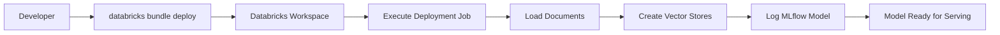
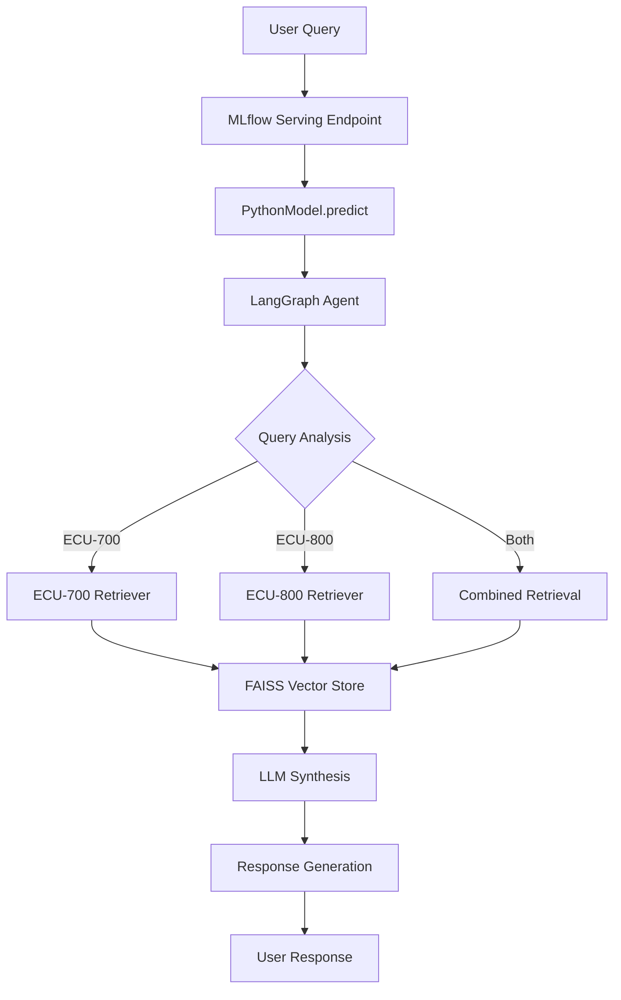

# Product Requirements Document - ME Engineering Assistant Agent

**Author:** Xiazhichao
**Date:** 2026-03-30
**Status:** Draft
**Version:** 1.0

---

## 📋 Document Control

| Field | Value |
|-------|-------|
| **Project Name** | ME Engineering Assistant Agent |
| **Document Version** | 1.0 |
| **Last Updated** | 2026-03-30 |
| **Status** | Draft |
| **Challenge Timeline** | 10 days (8-10 hours development) |

---

## 📖 Executive Summary

### Product Vision
Build an intelligent AI-powered assistant that enables ME Corporation engineers to quickly query and cross-reference Electronic Control Unit (ECU) specifications across multiple product lines through natural language conversations.

### Business Problem
ME engineers currently face inefficiencies when working with technical documentation spread across multiple product lines (ECU-700 Series and ECU-800 Series). Finding specific specifications or comparing features across products requires manual searching through multiple documents, leading to:
- Time-consuming information retrieval
- Potential for human error in cross-referencing
- Slow response to technical inquiries
- Knowledge silos across product generations

### Solution Overview
A multi-tool AI agent that combines:
- **Retrieval Augmented Generation (RAG)** for accurate document-based responses
- **LangGraph orchestration** for intelligent query routing
- **Multi-source integration** across ECU-700 and ECU-800 documentation
- **Production-ready deployment** via Databricks Asset Bundles and MLflow

### Value Proposition
- **70% faster** information retrieval (target: <10 seconds per query)
- **80% accuracy** on technical specification queries
- **Scalable foundation** for future document corpus expansion
- **Enterprise-grade MLOps** with versioned, deployable artifacts

---

## 🎯 Product Objectives

### Primary Objectives
1. **Accurate Query Resolution** - Achieve 80% accuracy (8/10) on predefined test queries
2. **Fast Response Time** - Respond to queries within 10 seconds
3. **Production Readiness** - Deploy via Databricks with proper MLOps practices
4. **Code Quality** - Maintain pylint score >85% with modular architecture

### Secondary Objectives
5. **Extensibility** - Architecture supports scaling to thousands of documents
6. **Evaluability** - Comprehensive testing and validation framework
7. **Maintainability** - Clear documentation and "python-package-first" design

---

## 👥 Target Users & Personas

### Primary Users

#### **Persona 1: Junior Hardware Engineer**
- **Role:** Early-career engineer learning ECU specifications
- **Goals:** Quick access to accurate specs, understand product differences
- **Pain Points:** Unfamiliar with legacy products, needs rapid onboarding information
- **Typical Queries:**
  - "What is the maximum operating temperature for ECU-800b?"
  - "Show me the processor specifications for ECU-750"
  - "What safety certifications does the ECU-700 series have?"

#### **Persona 2: Senior Systems Architect**
- **Role:** Experienced architect designing systems across product generations
- **Goals:** Compare specifications, make architecture decisions
- **Pain Points:** Needs cross-product analysis, detailed technical comparisons
- **Typical Queries:**
  - "Compare the CAN bus speed of ECU-750 and ECU-850"
  - "What are the key differences between ECU-700 and ECU-800 series?"
  - "Which ECU model supports AI acceleration?"

#### **Persona 3: Field Support Engineer**
- **Role:** Provides technical support to customers and partners
- **Goals:** Rapid response to customer inquiries, accurate information
- **Pain Points:** Time pressure, need for instant accurate answers
- **Typical Queries:**
  - "Does ECU-800b support dual CAN interfaces?"
  - "What is the power consumption of ECU-850?"
  - "Is ECU-750 suitable for automotive applications?"

### User Context
- **Environment:** Engineering office, lab, or remote work
- **Access Method:** Web interface or API integration
- **Usage Frequency:** Ad-hoc queries throughout the workday
- **Technical Proficiency:** High (engineers with technical background)

---

## 🎨 Functional Requirements

### Tier 1: Core AI/ML Engineering (60% Weight)

#### FR-1: Multi-Source RAG System
**Priority:** P0 (Must Have)

The system shall implement a Retrieval Augmented Generation (RAG) architecture that can retrieve and synthesize information from multiple documentation sources.

**Acceptance Criteria:**
- [ ] Successfully loads and indexes ECU-700 Series documentation
- [ ] Successfully loads and indexes ECU-800 Series documentation
- [ ] Performs semantic search across both document collections
- [ ] Returns relevant context chunks for user queries
- [ ] Handles single-document and cross-document queries

**Technical Specifications:**
- Document loading: Markdown format with header-aware chunking
- Chunk size: 500 characters with 50-character overlap
- Embedding model: OpenAI embeddings (via Databricks)
- Vector store: FAISS in-memory storage
- Retrieval strategy: Top-k (k=3 for ECU-700, k=4 for ECU-800)

---

#### FR-2: Intelligent Query Routing Agent
**Priority:** P0 (Must Have)

The system shall implement a LangGraph-based agent that intelligently routes queries to appropriate documentation sources based on query intent.

**Acceptance Criteria:**
- [ ] Analyzes user query to determine relevant product line(s)
- [ ] Routes ECU-700 queries to ECU-700 retriever tool
- [ ] Routes ECU-800 queries to ECU-800 retriever tool
- [ ] Handles comparative queries requiring both sources
- [ ] Synthesizes information from multiple sources into coherent response
- [ ] Falls back to general knowledge when tools unavailable

**Technical Specifications:**
- Agent framework: LangGraph
- LLM: gpt-4.1-mini (temperature=0 for consistency)
- Tool descriptions: Descriptive names for intelligent routing
- Execution loop: Automatic tool use until completion
- Error handling: Graceful degradation when tools fail

**Sample Query Types:**
1. **Single-Product Fact Retrieval:** "What is the max temp of ECU-800b?"
2. **Cross-Product Comparison:** "Compare CAN bus speeds of ECU-750 and ECU-850"
3. **Feature Identification:** "Which ECU models support AI acceleration?"

---

#### FR-3: MLflow Model Logging
**Priority:** P0 (Must Have)

The system shall package the LangGraph agent as a custom MLflow PyFunc model with proper version management.

**Acceptance Criteria:**
- [ ] Implements mlflow.pyfunc.PythonModel with predict() method
- [ ] Accepts multiple input formats (DataFrame, list, string, dict)
- [ ] Returns structured agent responses
- [ ] Logs model to MLflow Tracking Server
- [ ] Includes vector stores as model artifacts
- [ ] Supports model versioning and metadata

**Technical Specifications:**
- Model signature: Auto-inferred from sample inputs
- Artifact handling: Vector stores saved/loaded with model
- Batch processing: Support for multiple queries in single request
- Error isolation: Failed queries don't abort batch processing

---

#### FR-4: Architectural Documentation
**Priority:** P0 (Must Have)

The system shall include comprehensive architectural documentation explaining key design decisions.

**Acceptance Criteria:**
- [ ] Documents chunking strategy (why 500 chars, why overlap)
- [ ] Explains agent graph structure (nodes, edges, routing logic)
- [ ] Describes retriever tool design (separate vs. unified)
- [ ] Justifies technology choices (LangGraph, FAISS, etc.)
- [ ] Includes system architecture diagram
- [ ] Documents data flow from query to response

---

### Tier 2: Production MLOps Excellence (30% Weight)

#### FR-5: Databricks Asset Bundle (DAB) Packaging
**Priority:** P1 (Should Have)

The system shall be packaged as a complete Databricks Asset Bundle for reproducible deployment.

**Acceptance Criteria:**
- [ ] Valid databricks.yml configuration file
- [ ] Proper resource definitions (jobs, models, notebooks)
- [ ] Dependency management via pyproject.toml
- [ ] Bundle structure follows DAB best practices
- [ ] Deployable via `databricks bundle deploy` command
- [ ] Environment-specific configuration support

**Technical Specifications:**
- Bundle includes: source code, configuration, deployment scripts
- Python package: Installable via pip (not monolithic notebook)
- Resource naming: Follows ME platform conventions
- Versioning: Integrated with MLflow model versioning

---

#### FR-6: Automated Deployment Pipeline
**Priority:** P1 (Should Have)

The system shall include an automated Databricks Job that builds resources and logs the MLflow model.

**Acceptance Criteria:**
- [ ] Job definition in databricks.yml
- [ ] Automated document loading and vectorization
- [ ] Automated MLflow model logging
- [ ] Job success/failure notifications
- [ ] Idempotent deployment (re-run safe)
- [ ] Deployment status logging

**Technical Specifications:**
- Job triggers: Manual or scheduled
- Runtime environment: Databricks cluster with required libraries
- Logging: MLflow Tracking Server (SQLite for local, backend for prod)
- Error handling: Clear error messages for common failures

---

#### FR-7: Comprehensive Testing Strategy
**Priority:** P1 (Should Have)

The system shall include a documented testing and validation framework for production readiness.

**Acceptance Criteria:**
- [ ] Documented test cases covering:
  - Single-product fact queries
  - Cross-product comparisons
  - Edge cases (unknown products, ambiguous queries)
  - Error scenarios (missing docs, retrieval failures)
- [ ] Performance monitoring metrics (latency, accuracy, throughput)
- [ ] Error handling validation (common failure modes)
- [ ] Test data set with expected answers
- [ ] Automated test execution capability

**Testing Approach:**
- Unit tests: Individual component testing
- Integration tests: End-to-end query pipeline
- Evaluation metrics: Accuracy, response time, error rate
- Golden dataset: 10 predefined queries with ground truth

---

#### FR-8: REST API Serving & Error Handling
**Priority:** P1 (Should Have)

The MLflow model shall be servable via REST API with comprehensive error handling.

**Acceptance Criteria:**
- [ ] MLflow model serving endpoint responds to HTTP requests
- [ ] Returns JSON-formatted responses
- [ ] Handles malformed input gracefully
- [ ] Provides meaningful error messages
- [ ] Implements retry logic for transient failures
- [ ] Logs errors for debugging

**Technical Specifications:**
- Input format: JSON with query field
- Output format: JSON with response field and metadata
- Error codes: HTTP status codes with descriptive messages
- Logging: Structured logs for monitoring

---

### Tier 3: Innovation & Leadership (10% Weight)

#### FR-9 (Option A): Evaluation Framework
**Priority:** P2 (Nice to Have)

The system shall implement a comprehensive evaluation framework with MLflow integration.

**Acceptance Criteria:**
- [ ] Automated testing with predefined engineering questions
- [ ] Domain expertise validation using MLflow evaluation
- [ ] Custom evaluation metrics (accuracy, relevance, completeness)
- [ ] Performance metrics logging integrated into Databricks Job
- [ ] Evaluation results visualization

---

#### FR-10 (Option B): Human-in-the-Loop Integration
**Priority:** P2 (Nice to Have)

The system shall incorporate human oversight for low-confidence scenarios.

**Acceptance Criteria:**
- [ ] Confidence scoring for agent responses
- [ ] Threshold-based routing to human review
- [ ] Feedback collection mechanism
- [ ] Continuous improvement loop (feedback → fine-tuning)

---

#### FR-11 (Option C): Scalability Strategy
**Priority:** P2 (Nice to Have)

The system shall document a detailed strategy for scaling to thousands of documents.

**Acceptance Criteria:**
- [ ] Scalability analysis (bottlenecks, growth projections)
- [ ] Incremental update strategy (document additions, modifications)
- [ ] Performance optimization roadmap
- [ ] Architecture evolution plan (in-memory → distributed vector store)

---

#### FR-12 (Option D): Advanced Agent Behaviors
**Priority:** P2 (Nice to Have)

The system shall demonstrate advanced agentic capabilities.

**Acceptance Criteria:**
- [ ] Multi-step reasoning (break down complex queries)
- [ ] Tool composition (chain multiple retrievals)
- [ ] Query decomposition (split complex questions)
- [ ] Context retention across conversation turns

---

## ⚙️ Non-Functional Requirements

### NFR-1: Performance
| Metric | Target | Measurement Method |
|--------|--------|-------------------|
| Query Response Time | <10 seconds | End-to-end timing from query input to response |
| Accuracy Rate | ≥80% | 8/10 predefined test queries correct |
| Throughput | Not specified (single user focus) | N/A |

**Rationale:** 10-second threshold ensures engineers can get answers without significant workflow disruption. 80% accuracy balances feasibility with usefulness.

### NFR-2: Code Quality
| Metric | Target | Measurement Method |
|--------|--------|-------------------|
| Pylint Score | >85% | `pylint src/me_ecu_agent/` |
| Modularity | High | Component-based architecture |
| Maintainability | High | Clear separation of concerns, documented decisions |

**Rationale:** Senior-level engineering demonstration requires production-quality code, not prototype scripts.

### NFR-3: Architecture
| Requirement | Specification |
|-------------|---------------|
| Framework | LangChain + LangGraph |
| Vector Storage | FAISS (in-memory) |
| LLM | gpt-4.1-mini via Databricks |
| Embeddings | OpenAI embeddings via Databricks |
| Deployment | Databricks Asset Bundles (DABs) |
| Model Management | MLflow with custom PyFunc |
| Packaging | Python package (not notebooks) |

**Rationale:** Aligns with ME ECU Engineering Platform standards and challenge requirements.

### NFR-4: MLOps Maturity
| Practice | Implementation |
|----------|----------------|
| Version Control | Git-based, MLflow model versioning |
| Reproducibility | DAB packaging, dependency management |
| Monitoring | MLflow Tracking, performance metrics |
| Automation | Automated deployment pipeline |
| Documentation | Comprehensive README and architecture doc |

**Rationale:** Demonstrates senior-level MLOps capabilities required for Tier 2 evaluation.

### NFR-5: Scalability Considerations
| Aspect | Current Design | Future Path |
|--------|---------------|-------------|
| Document Corpus | Small (85 lines, 3 docs) | Plan for thousands of documents |
| Vector Store | In-memory FAISS | Distributed vector store (e.g., Pinecone, Milvus) |
| Retrieval Strategy | Full-document search | Hierarchical retrieval, hybrid search |
| Deployment | Single Databricks workspace | Multi-environment (dev, staging, prod) |

**Rationale:** Challenge allows small-scale implementation but expects foresight for enterprise scaling.

---

## 📊 Data Requirements

### Input Data: ECU Documentation Corpus

#### Document Structure
- **Format:** Markdown (.md files)
- **Total Size:** 85 lines across 3 documents
- **Content:** Technical specifications, configuration details, code snippets

#### Document List
1. **ECU-700_Series_Manual.md** (28 lines)
   - Content: ECU-750 specifications
   - Key data: Processor, memory, CAN interface, power, temperature
   - Characteristics: Legacy product, single CAN @1Mbps, 85°C max temp

2. **ECU-800_Series_Base.md** (26 lines)
   - Content: ECU-850 baseline model
   - Key data: Modern specifications, dual CAN @2Mbps, 105°C max temp
   - Characteristics: Current generation, improved performance

3. **ECU-800_Series_Plus.md** (31 lines)
   - Content: ECU-850b AI-enhanced variant
   - Key data: AI acceleration, advanced features
   - Characteristics: Premium model, AI capabilities

#### Data Characteristics
- **Structure:** Headers, tables, code blocks, lists
- **Language:** English, technical terminology
- **Comparisons:** Natural opportunities for cross-product analysis
- **Updates:** Static (no real-time updates expected)

### Data Processing Pipeline
1. **Loading:** Markdown files loaded from `data/` directory
2. **Splitting:** Header-aware chunking (500 chars, 50 overlap)
3. **Indexing:** Separate indices for ECU-700 and ECU-800 series
4. **Embedding:** OpenAI embeddings via Databricks
5. **Storage:** FAISS in-memory vector stores

---

## 🧪 Testing & Validation Requirements

### Test Categories

#### 1. Functional Testing
**Objective:** Validate system meets functional requirements

**Test Cases:**
- **TC-1:** Single-product fact retrieval (ECU-700)
  - Input: "What is the maximum operating temperature for ECU-750?"
  - Expected: "85°C" with supporting context

- **TC-2:** Single-product fact retrieval (ECU-800)
  - Input: "Does ECU-850 support dual CAN interfaces?"
  - Expected: "Yes, dual CAN @2Mbps" with details

- **TC-3:** Cross-product comparison
  - Input: "Compare the CAN bus speed of ECU-750 and ECU-850"
  - Expected: Structured comparison showing ECU-750 (1Mbps) vs ECU-850 (2Mbps)

- **TC-4:** Feature identification
  - Input: "Which ECU models support AI acceleration?"
  - Expected: "ECU-850b (800 Series Plus)" with explanation

- **TC-5:** Legacy vs modern analysis
  - Input: "What are the key differences between ECU-700 and ECU-800 series?"
  - Expected: Comprehensive comparison covering processor, CAN, temperature, features

**Success Criteria:** 8/10 test cases pass (80% accuracy)

#### 2. Performance Testing
**Objective:** Validate response time meets NFR-1

**Test Approach:**
- Measure end-to-end latency for each test case
- Repeat 3 times per query, average results
- All queries must complete within 10 seconds

**Success Criteria:** All queries <10 seconds

#### 3. Error Handling Testing
**Objective:** Validate graceful failure handling

**Test Cases:**
- **EH-1:** Empty query → Helpful error message
- **EH-2:** Unknown product name (ECU-999) → Graceful handling
- **EH-3:** Ambiguous query → Clarification request or best-effort response
- **EH-4:** Vector store unavailable → Fallback to direct context
- **EH-5:** LLM API failure → Clear error message

**Success Criteria:** All errors handled gracefully with user-friendly messages

#### 4. Code Quality Testing
**Objective:** Validate maintainability standards

**Test Approach:**
- Run pylint on all source code
- Check for proper documentation (docstrings, comments)
- Verify modular design (separation of concerns)

**Success Criteria:** Pylint score >85%

---

### Evaluation Metrics

| Metric | Definition | Target | Measurement Method |
|--------|-----------|--------|-------------------|
| Accuracy | % of test queries answered correctly | ≥80% | Manual evaluation against golden dataset |
| Latency | Time from query to response | <10s | Automated timing |
| Error Rate | % of queries resulting in errors | <10% | Automated logging |
| Code Quality | Pylint score | >85% | Static analysis |

---

## 🚀 Deployment Requirements

### Deployment Architecture

#### Target Environment: Databricks Workspace
- **Compute:** Databricks cluster with GPU support
- **Libraries:** LangChain, LangGraph, MLflow, FAISS, OpenAI
- **Storage:** MLflow Tracking Server, DBFS for artifacts
- **Networking:** Internal access to LLM and Embedding endpoints

#### Deployment Components
1. **Databricks Asset Bundle (DAB)**
   - Source code: Python package under `src/`
   - Configuration: `databricks.yml`
   - Dependencies: `pyproject.toml`
   - Resources: Jobs, models, notebooks

2. **MLflow Model**
   - Model type: Custom PyFunc
   - Artifacts: Vector stores (ECU-700, ECU-800)
   - Signature: Auto-inferred from sample inputs
   - Metadata: Challenge requirements, version info

3. **Databricks Job**
   - Trigger: Manual or scheduled
   - Tasks: Document loading → Vectorization → MLflow logging
   - Runtime: Databricks cluster with required libraries
   - Logging: MLflow Tracking Server

### Deployment Process

### Runtime Architecture

---

## 📝 Documentation Requirements

### Required Documentation Sections

#### 1. README.md (Single Source of Truth)
**Location:** Project root
**Purpose:** Comprehensive project documentation

**Required Sections:**
- [ ] **Project Overview** (1-2 paragraphs)
- [ ] **Architecture Design** (diagrams, key decisions)
  - Chunking strategy rationale
  - Agent graph structure explanation
  - Retriever tool design
  - Technology stack justification
- [ ] **Setup & Deployment** (step-by-step instructions)
  - Prerequisites (Databricks workspace, libraries)
  - Bundle deployment (`databricks bundle deploy`)
  - Model serving setup
  - Environment variables
- [ ] **Testing & Validation Strategy**
  - Proposed evaluation metrics
  - Automated testing approaches
  - Domain expertise validation methods (MLflow evaluation, golden datasets)
  - Continuous monitoring strategies
- [ ] **Usage Examples** (sample queries and responses)
- [ ] **Limitations & Future Work**
  - Current approach limitations
  - Potential improvements
  - Scalability considerations

#### 2. Architecture Decision Records (ADRs)
**Location:** `docs/adr/` or inline in README
**Purpose:** Document key architectural decisions

**Required ADRs:**
- [ ] ADR-001: Chunking Strategy (500 chars, 50 overlap)
- [ ] ADR-002: Separate vs. Unified Vector Stores
- [ ] ADR-003: LangGraph Agent Design
- [ ] ADR-004: FAISS vs. Alternative Vector Stores
- [ ] ADR-005: MLflow PyFunc Wrapper Design

#### 3. API Documentation
**Location:** `docs/api.md` or inline
**Purpose:** Document model interface

**Required Content:**
- [ ] Input formats (DataFrame, list, string, dict)
- [ ] Output format (JSON structure)
- [ ] Error codes and handling
- [ ] Sample requests/responses

---

## ⚠️ Assumptions, Dependencies, & Constraints

### Assumptions
1. **Document Availability:** ECU documentation is static and available in Markdown format
2. **LLM Access:** Databricks workspace provides access to required LLM and Embedding models
3. **Single User:** System designed for single-user scenarios (no concurrency requirements)
4. **Small Corpus:** Current document size (85 lines) allows in-memory vector stores
5. **English Language:** All documentation and queries in English

### Dependencies
1. **External Services:**
   - Databricks workspace (compute, storage)
   - LLM endpoint (gpt-4.1-mini via Databricks)
   - Embedding endpoint (OpenAI via Databricks)
   - MLflow Tracking Server

2. **Python Libraries:**
   - langchain >=0.1.0
   - langgraph >=0.0.20
   - mlflow >=2.10.0
   - faiss-cpu >=1.7.4
   - openai >=1.0.0
   - pydantic >=2.0.0

3. **Platform Resources:**
   - ME BIOS repository (templates, patterns)
   - ME platform documentation (examples, guides)

### Constraints
1. **Timeline:** 10 days total, 8-10 hours active development
2. **Technology Stack:** Python, LangChain, LangGraph, FAISS, Databricks
3. **Deployment:** Must use Databricks Asset Bundles (DABs)
4. **Packaging:** Python package (not monolithic notebooks)
5. **Model Management:** MLflow with custom PyFunc
6. **Code Quality:** Pylint score >85%

### Technical Fallback Options
Per challenge requirements, acceptable fallbacks include:
1. **Vector Store Issues:** Pass document content directly as LLM context
2. **DAB Deployment Problems:** Manual MLflow logging with detailed deployment plan
3. **Alternative Frameworks:** Different agent frameworks with proper justification

---

## 🎯 Success Criteria & Acceptance

### Tier 1: Core AI/ML Engineering (60% - Must Pass)
- [ ] Functional multi-source RAG system
- [ ] Working LangGraph agent with intelligent routing
- [ ] Basic MLflow model logging with predict() method
- [ ] Architectural documentation with design rationale
- [ ] **8/10 test queries answered correctly (≥80% accuracy)**
- [ ] **Response time <10 seconds per query**
- [ ] **Pylint score >85%**

### Tier 2: Production MLOps Excellence (30% - Distinguishes Senior Level)
- [ ] Complete DAB packaging with working databricks.yml
- [ ] Automated deployment job (builds and logs model)
- [ ] Comprehensive testing strategy (documented)
- [ ] Performance monitoring and error handling
- [ ] **DAB deploys successfully in provided workspace**
- [ ] **MLflow model serves via REST API**

### Tier 3: Innovation & Leadership (10% - Demonstrates Technical Leadership)
Select **1-2** of the following:
- [ ] **Evaluation Framework:** Automated testing + MLflow evaluation + custom metrics
- [ ] **Human-in-the-Loop:** Low-confidence scenario handling + feedback mechanism
- [ ] **Scalability Strategy:** Detailed plan for scaling to thousands of documents
- [ ] **Advanced Agent Behaviors:** Multi-step reasoning + tool composition + query decomposition

### Final Deliverable Checklist
- [ ] Databricks Asset Bundle (deployable)
- [ ] MLflow Model (logged and servable)
- [ ] Deployment Job (automated pipeline)
- [ ] Comprehensive README.md (all required sections)
- [ ] Architecture documentation (diagrams, ADRs)
- [ ] Testing strategy (documented and executable)
- [ ] Code review presentation (45-minute)

---

## 📅 Timeline & Milestones

### Recommended Development Schedule (10 days)

#### **Days 1-3: Tier 1 Core Development (5-6 hours)**
- Day 1: Project setup, document processing, vector stores
- Day 2: LangGraph agent implementation, retriever tools
- Day 3: MLflow packaging, basic testing

#### **Days 4-6: Tier 2 Production Readiness (2-3 hours)**
- Day 4: DAB packaging, databricks.yml configuration
- Day 5: Deployment pipeline automation
- Day 6: Comprehensive testing, error handling

#### **Days 7-8: Tier 3 Innovation (1-2 hours)**
- Day 7: Selected advanced feature(s) implementation
- Day 8: Refinement, optimization

#### **Days 9-10: Documentation & Presentation (2-3 hours)**
- Day 9: Comprehensive documentation (README, ADRs, API docs)
- Day 10: Presentation preparation, final testing

---

## 🔄 Change History

| Version | Date | Author | Changes |
|---------|------|--------|---------|
| 1.0 | 2026-03-30 | Xiazhichao | Initial PRD creation from challenge requirements |

---

## 📎 Appendix

### A. Sample Queries (Golden Dataset)
1. "What is the maximum operating temperature for ECU-800b?"
2. "Compare the CAN bus speed of ECU-750 and ECU-850"
3. "Which ECU models support AI acceleration?"
4. "What is the power consumption of ECU-750?"
5. "Does ECU-800b support dual CAN interfaces?"
6. "Show me the processor specifications for ECU-750"
7. "What are the key differences between ECU-700 and ECU-800 series?"
8. "Is ECU-750 suitable for high-temperature automotive applications?"
9. "What safety certifications does the ECU-800 series have?"
10. "Compare the memory specifications of ECU-750 and ECU-850b"

### B. Technology Stack Justification
- **LangChain:** Industry-standard RAG framework with excellent Databricks integration
- **LangGraph:** Advanced agent orchestration with routing and multi-tool support
- **FAISS:** Efficient in-memory vector search (suitable for small corpus)
- **MLflow:** Enterprise-grade model management with Databricks native support
- **Databricks Asset Bundles:** Infrastructure-as-code approach for reproducible deployments

### C. References
- [ME BIOS Repository](https://github.boschdevcloud.com/bios-eco-mde/ai-platform/)
- [ME Platform Documentation](https://pages.github.boschdevcloud.com/bios-eco-mde/ai-platform/)
- [LangGraph Documentation](https://langchain-ai.github.io/langgraph/)
- [MLflow Documentation](https://mlflow.org/docs/latest/)
- [Databricks Asset Bundles](https://docs.databricks.com/dev-tools/bundles/index.html)

---

**End of PRD v1.0**
