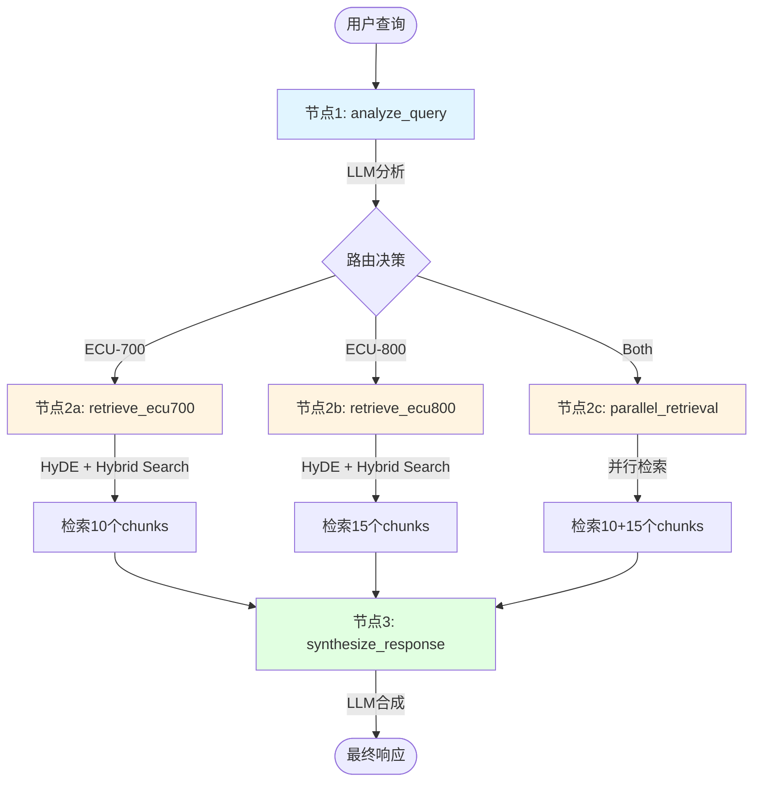
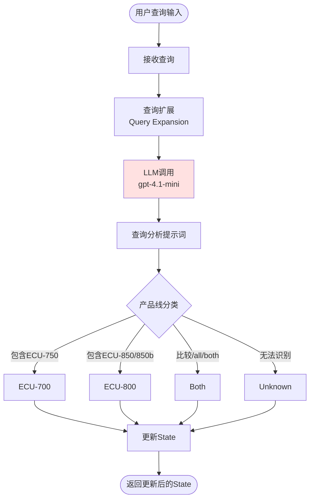
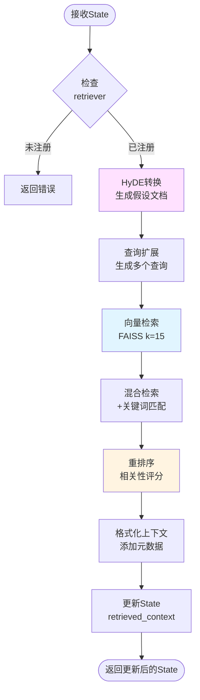
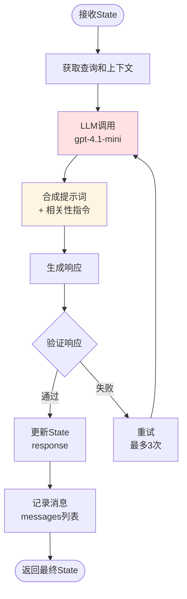
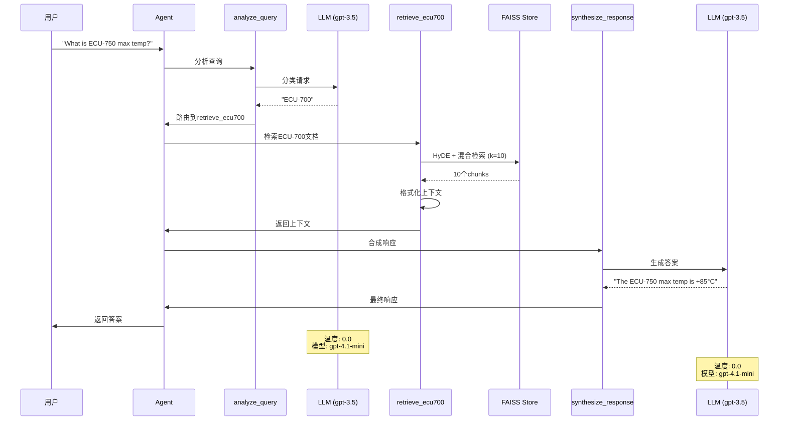
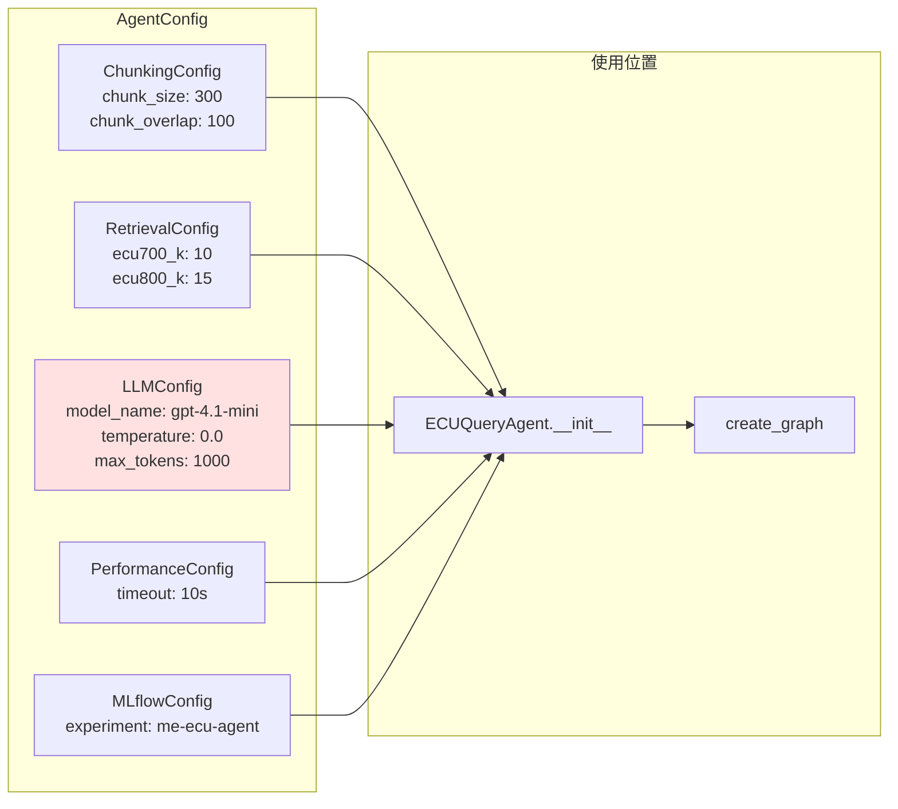

# LangGraph Agent 架构可视化

## 1. Mermaid流程图



## 2. 状态转换图

```mermaid
stateDiagram-v2
    [*] --> Initial: 用户提交查询
    Initial --> Analyzing: analyze_query节点
    Analyzing --> Routing: LLM分析完成

    Routing --> Retrieving_700: 检测到ECU-700
    Routing --> Retrieving_800: 检测到ECU-800
    Routing --> Retrieving_Both: 检测到Both

    Retrieving_700 --> Synthesizing: 检索完成(k=10)
    Retrieving_800 --> Synthesizing: 检索完成(k=15)
    Retrieving_Both --> Synthesizing: 检索完成(k=10+15)

    Synthesizing --> [*]: 响应生成完成

    note right of Analyzing
        使用LLM (gpt-4.1-mini)
        识别查询类型
    end note

    note right of Synthesizing
        使用LLM (gpt-4.1-mini)
        基于上下文合成答案
    end note
```



## 3. 数据流图

```mermaid
flowchart LR
    subgraph Input["输入层"]
        Query["用户查询"]
    end

    subgraph Analysis["分析层"]
        LLM1["LLM<br/>gpt-4.1-mini"]
        Class["产品线分类<br/>ECU-700/800/both"]
    end

    subgraph Retrieval["检索层"]
        HyDE["HyDE<br/>假设文档生成"]
        Hybrid["混合检索<br/>语义+关键词"]
        Expand["查询扩展<br/>多查询"]
        Vector["向量存储<br/>FAISS"]
    end

    subgraph Synthesis["合成层"]
        Context["检索上下文"]
        LLM2["LLM<br/>gpt-4.1-mini"]
        Prompt["合成提示词"]
    end

    subgraph Output["输出层"]
        Response["最终响应"]
    end

    Query --> LLM1
    LLM1 --> Class
    Class --> HyDE
    HyDE --> Expand
    Expand --> Hybrid
    Hybrid --> Vector
    Vector --> Context
    Context --> Prompt
    Prompt --> LLM2
    LLM2 --> Response

    style LLM1 fill:#ffe1e1
    style LLM2 fill:#ffe1e1
    style Vector fill:#e1f5ff
```



## 4. 系统架构层次图

```mermaid
graph TB
    subgraph ["应用层"]
        Agent["ECUQueryAgent<br/>LangGraph"]
    end

    subgraph ["编排层"]
        Graph["StateGraph<br/>工作流编排"]
        Nodes["5个节点<br/>analyze, retrieve, synthesize"]
        Routing["条件路由<br/>动态决策"]
    end

    subgraph ["LLM层"]
        GPT35["gpt-4.1-mini<br/>查询分析"]
        GPT35_2["gpt-4.1-mini<br/>响应合成"]
        Config["LLMConfig<br/>model_name: gpt-4.1-mini<br/>temperature: 0.0"]
    end

    subgraph ["检索增强层"]
        HyDE["HyDE<br/>假设文档"]
        Hybrid["Hybrid Search<br/>混合检索"]
        Expand["Query Expansion<br/>查询扩展"]
        Rerank["重排序"]
    end

    subgraph ["存储层"]
        FAISS1["FAISS Store<br/>ECU-700<br/>k=10"]
        FAISS2["FAISS Store<br/>ECU-800<br/>k=15"]
        Docs["文档集合<br/>3个MD文件"]
    end

    Agent --> Graph
    Graph --> Nodes
    Nodes --> Routing

    Nodes --> GPT35
    Nodes --> GPT35_2
    GPT35 --> Config
    GPT35_2 --> Config

    Nodes --> HyDE
    HyDE --> Hybrid
    Hybrid --> Expand
    Expand --> Rerank

    Rerank --> FAISS1
    Rerank --> FAISS2
    FAISS1 --> Docs
    FAISS2 --> Docs

    style Agent fill:#e1f5ff
    style GPT35 fill:#ffe1e1
    style GPT35_2 fill:#ffe1e1
    style FAISS1 fill:#e1ffe1
    style FAISS2 fill:#e1ffe1
```

## 5. 节点详细流程

### 5.1 analyze_query节点



### 5.2 retrieve节点（以ECU-800为例）



### 5.3 synthesize_response节点



## 6. 完整工作流程示例

### 场景: 用户询问ECU-750的最大温度



## 7. 配置文件结构



---

## 使用说明

### 查看图形
1. 复制上述Mermaid代码
2. 访问 https://mermaid.live
3. 粘贴代码查看可视化图形

### 修改LLM模型
编辑 `src/me_ecu_agent/config.py` 第52行：
```python
model_name: str = "gpt-4"  # 改为gpt-4或其他模型
```

### 调整检索参数
编辑 `src/me_ecu_agent/config.py` 第41-42行：
```python
ecu700_k: int = 10  # 调整ECU-700检索数量
ecu800_k: int = 15  # 调整ECU-800检索数量
```

---

*创建日期: 2026-03-30*
*项目: Bosch ECU Code Challenge*
